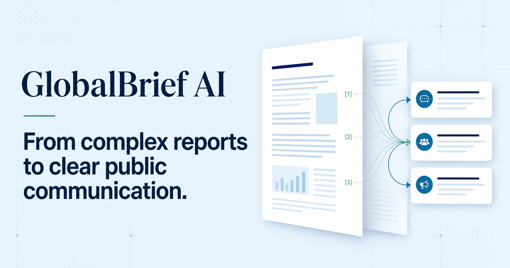

# GlobalBrief AI

**An evidence-based communication planning prototype for international public information work.**



GlobalBrief AI is an independent portfolio project exploring how responsible AI-supported workflows can help communication teams translate complex public reports into structured, audience-focused communication briefs.

The project is designed around the working practices of Communication and Public Information Officers: source traceability, stakeholder analysis, accessible communication, channel planning and human editorial review.

> This is a portfolio demonstration using a public report. Outputs are illustrative and require human review. The project has no official affiliation with any international organization.

## Project purpose

Long policy and research reports contain valuable evidence, but turning that evidence into clear public information requires more than summarization. GlobalBrief AI demonstrates a reviewable workflow that connects source material to:

- report themes and key findings;
- evidence-linked key messages;
- stakeholder and audience analysis;
- platform-specific public information drafts;
- communication materials for policy, public and media use.

The central design question is: **How can AI support communication planning while preserving evidence traceability, professional judgement and editorial accountability?**

## Core features

- **Evidence-based executive summary** — report overview, main themes, key findings, evidence areas and communication implications.
- **Source traceability** — page references, direct quotations or extracted data, and communication relevance.
- **Interactive analysis scope** — side panels explain how themes, findings and evidence relate to the source report.
- **Audience analysis matrix** — audience role, communication needs, recommended approach and channels.
- **Communication modes** — policy, public and media communication outputs based on the same evidence base.
- **Public information products** — illustrative LinkedIn, X and Instagram drafts with purpose, audience and hashtags.
- **Multilingual interface** — English, French and Chinese.
- **Sample report workflow** — a complete demonstration using *Progress on the Sustainable Development Goals: The Gender Snapshot 2025*.
- **PDF upload prototype** — client-side file validation with a 12 MB limit and a simulated analysis workflow.

## Responsible AI approach

GlobalBrief AI is designed as drafting and planning support, not an autonomous publishing system.

- Extracted evidence is separated from communication interpretation.
- Source pages remain visible throughout the analysis.
- Outputs are editable and require human verification.
- Global findings are not presented as universally applicable national conclusions.
- No content is automatically approved or published.

## Demonstration status

This repository contains a portfolio prototype rather than a production AI service.

- No external AI API is connected.
- Uploaded PDF contents are not sent to a server or third party.
- The upload endpoint receives file metadata only and returns illustrative demo content.
- The bundled sample analysis is based on selected evidence from the public report and is intended to demonstrate the information architecture and communication workflow.

The sample report is a public publication produced by UN Women and the United Nations Department of Economic and Social Affairs Statistics Division. Inclusion of the report does not imply endorsement of this project.

## Technology

- React 19
- TypeScript
- Tailwind CSS
- Next.js 16 with the App Router
- PDF.js for local PDF handling

## Local development

### Requirements

- Node.js 22.13 or newer
- pnpm

### Run locally

```bash
pnpm install
pnpm dev
```

Open [http://localhost:3000](http://localhost:3000).

No API key is required for the portfolio demonstration.

## Available commands

```bash
pnpm dev      # Start the local development server
pnpm build    # Create a production build
pnpm lint     # Run code-quality checks
pnpm test     # Build and run the automated tests
```

## Main routes

- `/` — project landing page and portfolio context
- `/upload` — PDF registration and communication planning parameters
- `/results` — evidence-based communication brief workspace
- `/api/analyze` — metadata-only prototype analysis endpoint

## Project structure

```text
app/          Routes, pages and API endpoint
components/   Shared interface components
lib/          Demo analysis, communication modes and localization
public/       Public assets and the sample report
tests/        Rendered-page and API workflow tests
```

## Portfolio context

This project demonstrates competencies relevant to international communication and public information roles, including:

- evidence-based communication;
- message development and editorial judgement;
- stakeholder and audience analysis;
- accessible, multilingual public information;
- responsible use of emerging technologies.
